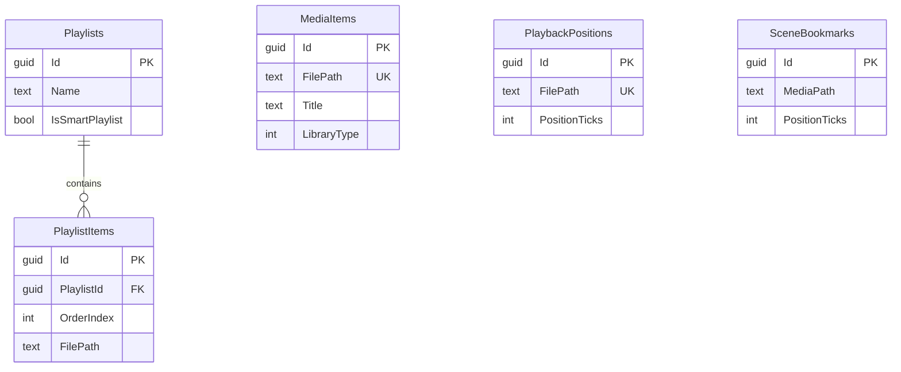

# DPlayer Database Schema

SQLite database: `%LocalAppData%\DPlayer\dplayer.db`

Managed by Entity Framework Core with `EnsureCreated` on first launch.

## Tables

### MediaItems
Indexed media library entries from folder scans.

| Column | Type | Description |
|--------|------|-------------|
| Id | GUID (PK) | Unique identifier |
| FilePath | TEXT (unique) | Absolute file path |
| Title | TEXT | Display title |
| Artist | TEXT | Audio artist |
| Album | TEXT | Audio album |
| DurationTicks | INTEGER | Media duration |
| MediaType | INTEGER | 0=Unknown, 1=Video, 2=Audio |
| FileSizeBytes | INTEGER | File size |
| DateAdded | DATETIME | Index timestamp |
| LastPlayed | DATETIME | Last playback time |
| LastPositionTicks | INTEGER | Last known position |
| ThumbnailPath | TEXT | Thumbnail file path |
| PosterPath | TEXT | Poster art path |
| LibraryType | INTEGER | Movie/TV/Episode/Music/Other |
| SeriesTitle | TEXT | TV series name |
| Season | INTEGER | Season number |
| Episode | INTEGER | Episode number |
| MetadataJson | TEXT | Extended metadata JSON |

**Indexes:** `FilePath` (unique), `Title`, `LibraryType`

### Playlists

| Column | Type | Description |
|--------|------|-------------|
| Id | GUID (PK) | Playlist ID |
| Name | TEXT | Playlist name |
| Description | TEXT | Optional description |
| IsSmartPlaylist | BOOLEAN | Smart playlist flag |
| SmartFilter | TEXT | Filter expression |
| CreatedAt | DATETIME | Creation time |
| ModifiedAt | DATETIME | Last modified |

### PlaylistItems

| Column | Type | Description |
|--------|------|-------------|
| Id | GUID (PK) | Entry ID |
| PlaylistId | GUID (FK) | Parent playlist |
| OrderIndex | INTEGER | Sort order |
| FilePath | TEXT | Media file path |
| Title | TEXT | Display title |
| DurationTicks | INTEGER | Track duration |

**Indexes:** `(PlaylistId, OrderIndex)`

### Favorites

| Column | Type | Description |
|--------|------|-------------|
| Id | GUID (PK) | Entry ID |
| FilePath | TEXT | Media path |
| AddedAt | DATETIME | When favorited |

### WatchLater

| Column | Type | Description |
|--------|------|-------------|
| Id | GUID (PK) | Entry ID |
| FilePath | TEXT | Media path |
| AddedAt | DATETIME | When added |

### PlaybackPositions

| Column | Type | Description |
|--------|------|-------------|
| Id | GUID (PK) | Entry ID |
| FilePath | TEXT (unique) | Media path |
| PositionTicks | INTEGER | Saved position |
| UpdatedAt | DATETIME | Last update |

### SceneBookmarks

| Column | Type | Description |
|--------|------|-------------|
| Id | GUID (PK) | Bookmark ID |
| MediaPath | TEXT | Media file path |
| PositionTicks | INTEGER | Timestamp |
| Label | TEXT | User label |
| ThumbnailPath | TEXT | Screenshot path |
| CreatedAt | DATETIME | Creation time |

### Settings

| Column | Type | Description |
|--------|------|-------------|
| Key | TEXT (PK) | Setting key |
| Value | TEXT | JSON-serialized value |

### RecentFiles

| Column | Type | Description |
|--------|------|-------------|
| Id | GUID (PK) | Entry ID |
| FilePath | TEXT (unique) | Media path |
| Title | TEXT | Display title |
| LastOpened | DATETIME | Last access time |

## ER Diagram

## Settings File

Primary app settings are stored in `settings.json` (not SQLite) for fast access. The `Settings` table serves as a secondary key-value store for plugins and extensions.
